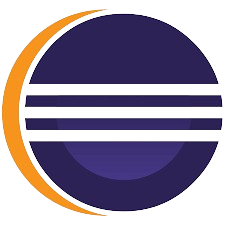
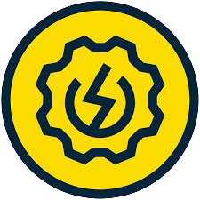
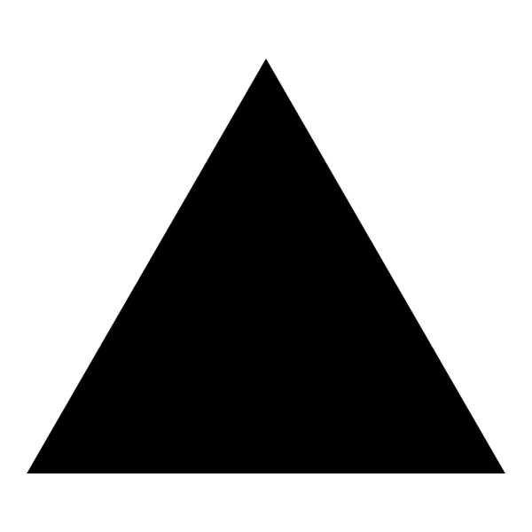

#

  <code><a href="https://www.linkedin.com/in/p-munoz/" title="LinkedIn Profile" target="_blank"> LinkedIn</a></code>

 

  Soy Paul Muñoz, un apasionado por la tecnología y el aprendizaje continuo. Me encanta descubrir cómo funcionan las cosas y encontrar maneras de mejorarlas. En mis tiempos libres, disfruto escuchar música, jugar ajedrez y mirar películas.  
  Mi objetivo es seguir creciendo como profesional en el campo de la tecnología, aprender constantemente y contribuir a proyectos que marquen la diferencia. Estoy siempre en busca de nuevas oportunidades para aplicar mis habilidades y enfrentar nuevos desafíos.

 

<h2 align="center">🔥 Habilidades 🔥</h2>

<table align="center">
  <tr>
    <!-- Columna 1 -->
    <td align="center" valign="top">
      <h3 align="center">🧑‍💻 Lenguajes de programación</h3>
      <code></code>
      <code></code>
      <code></code>
      <h3 align="center">🌐 Tecnologías Web y Estilos</h3>
      <code></code>
      <code></code>
      <code></code>
      <h3 align="center">🚀 Frameworks y librerías</h3>
      <code></code>
      <code></code>
      <code></code>
      <code></code>
      <h3 align="center">🛢️ Bases de datos y herramientas de gestión</h3>
      <code></code>
      <code></code>
      <code></code>
      <code></code>
    </td>
    <!-- Columna 2 -->
    <td align="center" valign="top">
      <h3 align="center">🧑‍💻 IDEs y editores</h3>
      <code></code>
      <code></code>
      <code></code>
      <code></code>
      <code></code>
      <code></code>
      <h3 align="center">🛠️ Herramientas y control de versiones</h3>
      <code></code>
      <code></code>
      <code></code>
      <code></code>
      <h3 align="center">🔌 Herramientas de prueba de APIs</h3>
      <code></code>
      <code></code>
      <code></code>
      <h3 align="center">☁️ Cloud & Hosting</h3>
      <code></code>
      <code></code>  
    </td>
  </tr>
</table>

 

<h2 align="center">🎯 Competencias en desarrollo 🎯</h2>

<table align="center">
  <tr>
    <!-- Columna 1 -->
    <td align="center" valign="top">
      <h3>🔧 Lenguajes y frameworks</h3>
      <code></code>
      <code></code>
      <code></code>
    </td>
    <!-- Columna 2 -->
    <td align="center" valign="top">
      <h3>⚙️ Automatización</h3>
      <code></code>
    </td>
    <!-- Columna 3 -->
    <td align="center" valign="top">
      <h3>☁️ Servicios Cloud & Backend</h3>
        <code></code>
        <code></code>  
    </td>
  </tr>
</table>

 

<h2 align="center">⚡ Estadísticas ⚡</h2>
 

  

    
    <!--  -->
  

  <!--         
  

    
  
 -->

 

<h2 align="center">👨‍💻 Proyectos destacados 👨‍💻</h2>
 

  

    
     
  

  
          

  

    
    
  

        

