#

 

  Soy Paul Muñoz, desarrollador fullstack apasionado por la tecnología y el aprendizaje continuo. Disfruto construir aplicaciones, explorar nuevas herramientas y entender cómo funcionan las cosas para encontrar maneras de mejorarlas. 

  Actualmente trabajo principalmente con tecnologías como Java, Spring Boot, React y TypeScript, mientras continúo explorando herramientas modernas del ecosistema cloud y DevOps. 

  En mi tiempo libre disfruto escuchar música, jugar ajedrez y ver películas. Siempre estoy en busca de nuevos desafíos y oportunidades para seguir creciendo profesionalmente y contribuir a proyectos que generen impacto.

 

<h2 align="center">🔥 Habilidades 🔥</h2>

<table align="center">
  <tr>
    <!-- Columna 1 -->
    <td align="center" valign="top">
      <h3 align="center">🧑‍💻 Lenguajes de programación</h3>
      <code></code>
      <code></code>
      <code></code>
      <code></code>
      <code></code>
      <h3 align="center">🌐 Frontend</h3>
      <code></code>
      <code>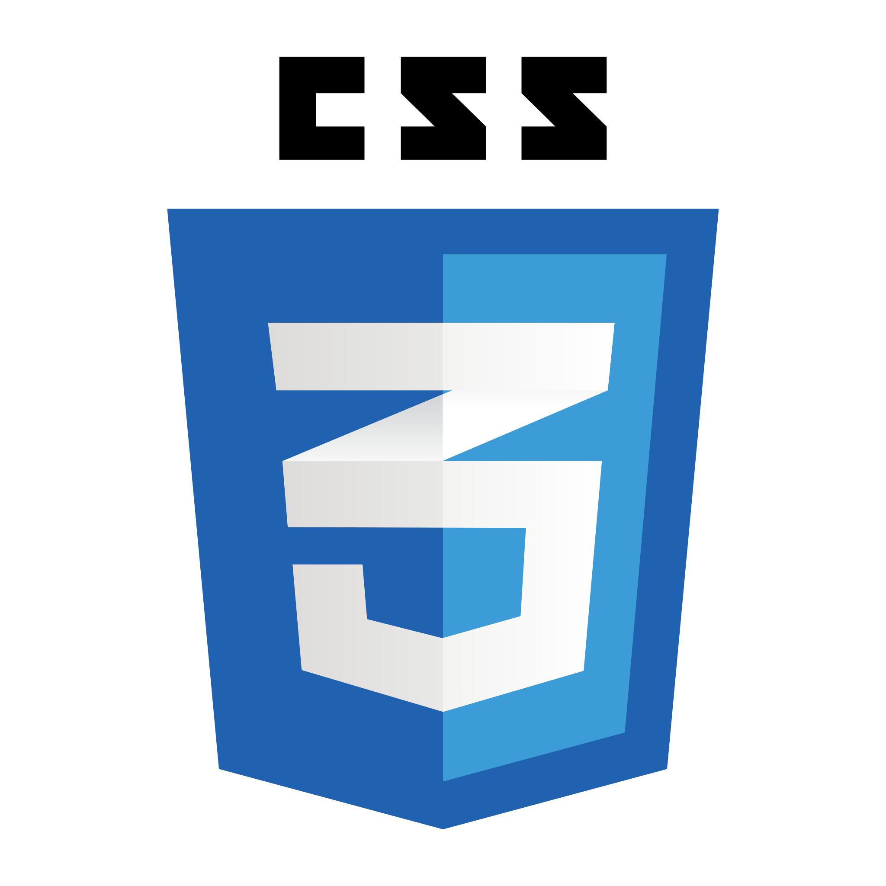</code>
      <code></code>
      <code></code>
      <code>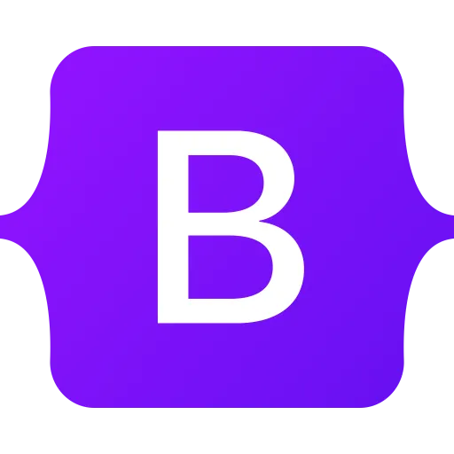</code>
      <code></code>
      <h3 align="center">⚙️ Backend</h3>
      <code></code>
      <code>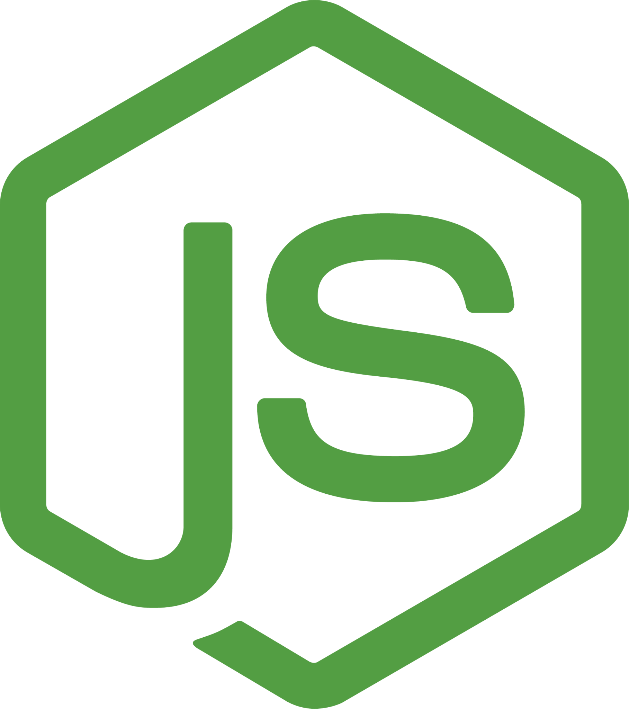</code>
      <h3 align="center">🛢️ Bases de datos y herramientas de gestión</h3>
      <code></code>
      <code></code>
      <code>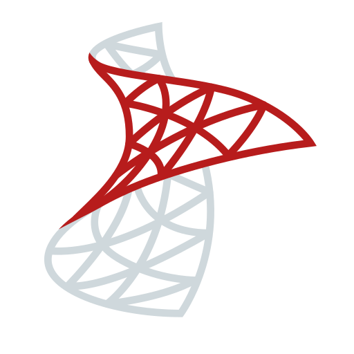</code>
      <h3 align="center">🧰 Herramientas de Base de Datos</h3>
      <code>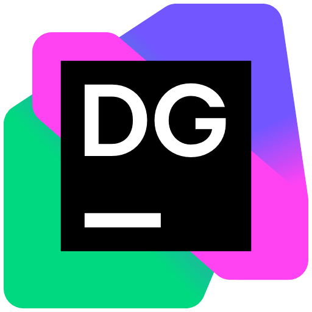</code>
      <code></code>
      <code></code>
    </td>
    <!-- Columna 2 -->
    <td align="center" valign="top">
      <h3 align="center">💻 IDEs y editores</h3>
      <code>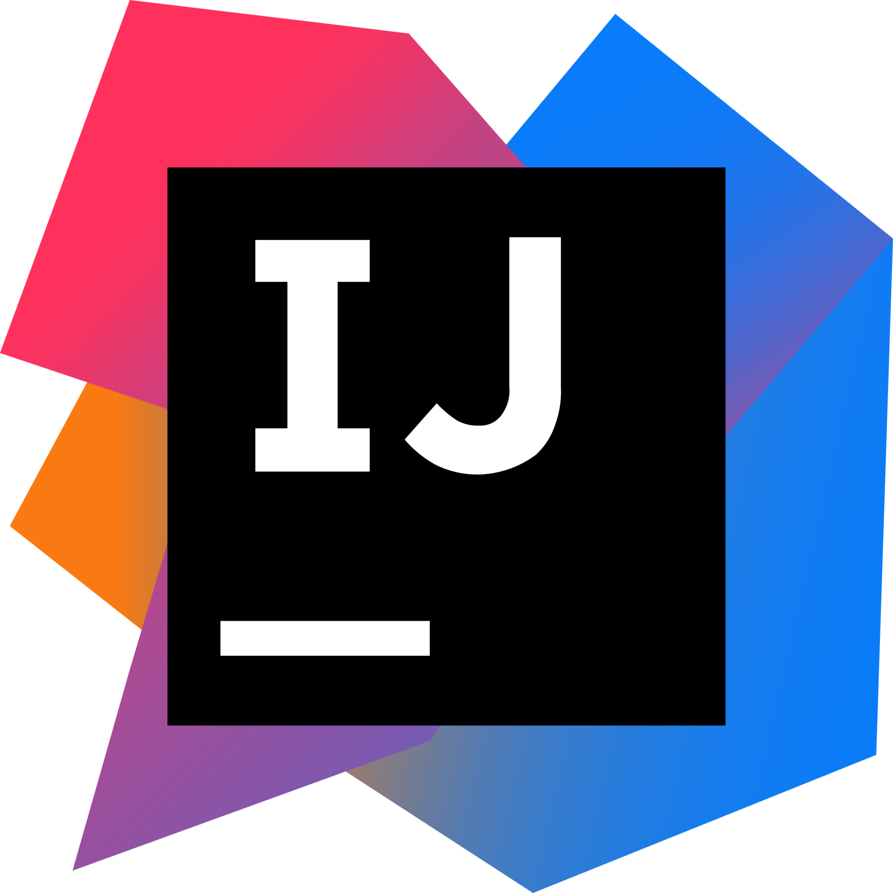</code>
      <code>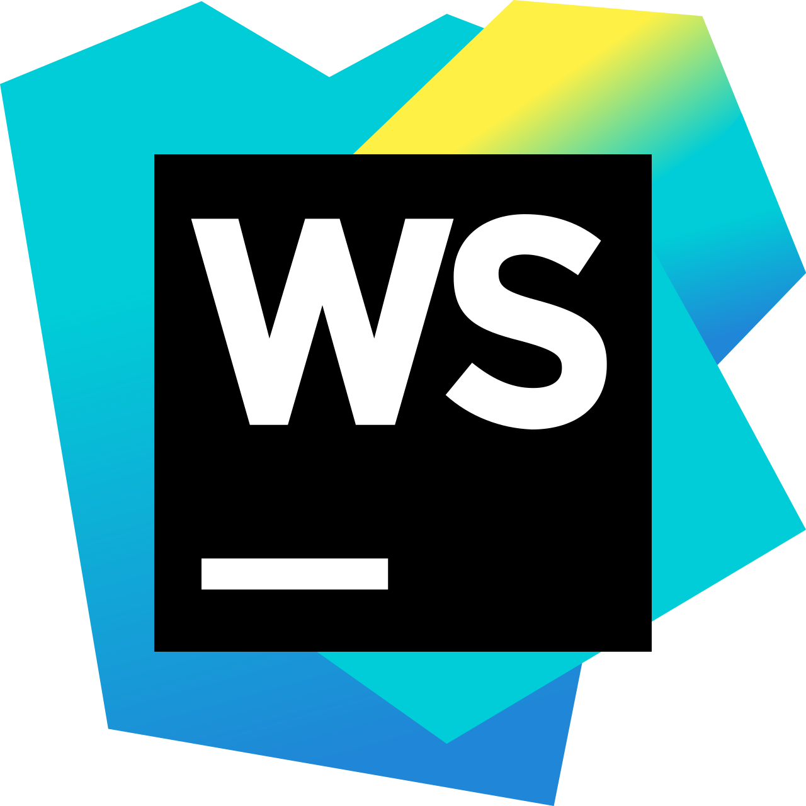</code>
      <code></code>
      <code></code>
      <code>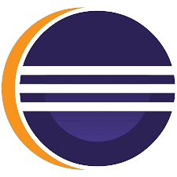</code>
      <code></code>
      <code>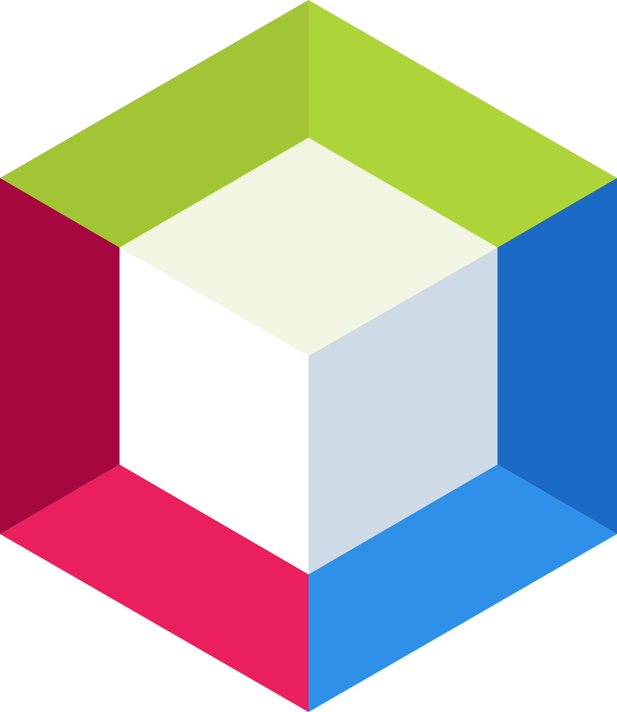</code>
      <h3 align="center">🔌 APIs y Testing</h3>
      <code></code>
      <code>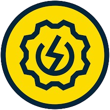</code>
      <code></code>
      <code>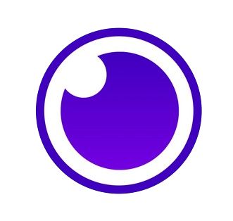</code>
      <h3 align="center">🔧 DevOps & Tools</h3>
      <code></code>
      <code></code>
      <code></code>
      <code>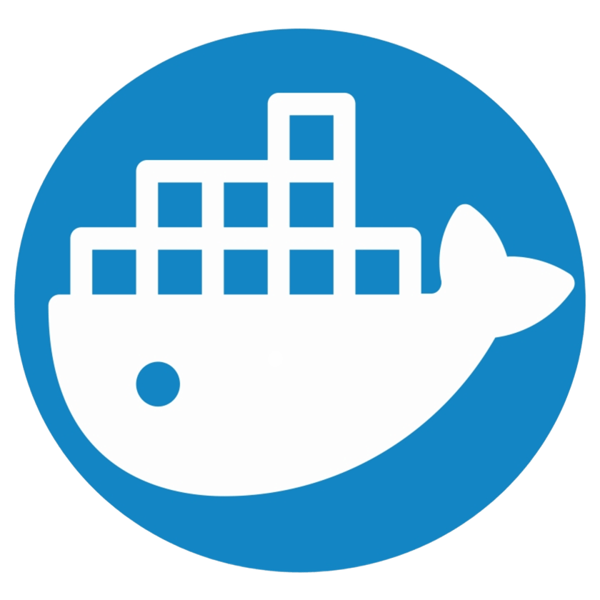</code>
      <code></code>
      <code></code>
      <h3 align="center">☁️ Cloud & Deploy</h3>
      <code></code>
      <code></code>
      <code>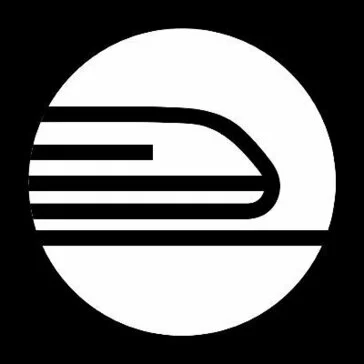</code>
      <code></code>
      <code>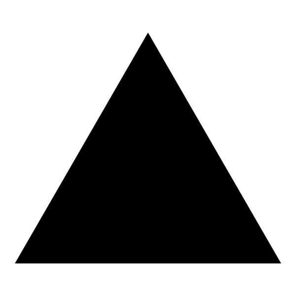</code>
      <h3 align="center">☁️ Backend & Cloud Services</h3>
      <code></code>
      <code>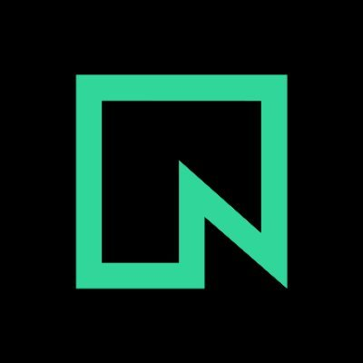</code>  
    </td>
  </tr>
</table>

 

<h2 align="center">🎯 Explorando actualmente 🎯</h2>

<table align="center">
  <tr>
    <td align="center" valign="top">
      <h3>🚀 Frameworks & DevOps</h3>
      <code>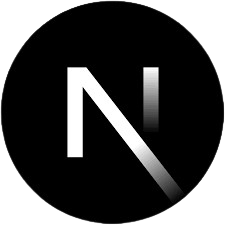</code>
      <code>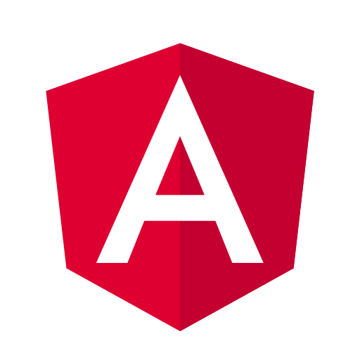</code>
      <code></code>  
    </td>
  </tr>
</table>

 

<h2 align="center">⚡ Estadísticas ⚡</h2>
 

  

    
  

 